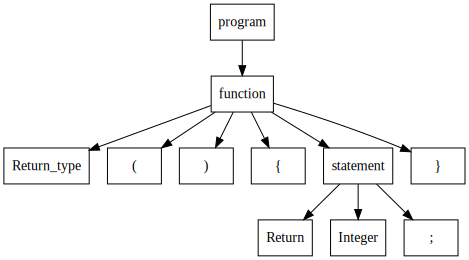

# 实验报告 - step1

无83 &ensp; 周君宝 &ensp; 2018011106

## Part1  词法分析、语法分析、目标代码生成

### 实验目的

阅读 `minilexer` 和 `miniparser` 的代码实现，理解词法分析和语法分析的流程。

学会使用 `minilexer` 和 `minipaser` ，通过控制输入得到自己想要的 `token` 流和语法树。

### 1. 修改 `lex` 输入使 `minilexer` 报错

把 `minilexer.py` 的输入修改为如下：

```cpp
int main() {
	int i = 9;
	return i;
}
```

输出报错：

```bash
token kind   text
-----------  ------------------- 
Int          int
Identifier   main
Lparen       (
Rparen       )
Lbrace       {
Int          int
Identifier   i
Traceback (most recent call last):
  File "d:/MyData/Programming/Compile/minidecaf-tutorial-code/step1/minilexer.py", line 101, in <module>
	dumpLexerTokens(default())
  File "d:/MyData/Programming/Compile/minidecaf-tutorial-code/step1/minilexer.py", line 96, in dumpLexerTokens
	for tok in lexer.lex():
  File "d:/MyData/Programming/Compile/minidecaf-tutorial-code/step1/minilexer.py", line 45, in lex
	raise Exception(f"lex error at input position {self.pos}")
Exception: lex error at input position 31
```

原因是 `minilexer.py` 中未定义 `=` 的 `token` ，导致出现错误。

### 2. 修改 `lex` 输入使 `miniparser` 报错

把 `minilexer.py` 中的输入修改为如下：

```cpp
int main() {
	int i;
	return i;
}
```

`minilexer.py` 的输出如下

```bash
token kind   text
-----------  -------------------
Int          int
Identifier   main
Lparen       (
Rparen       )
Lbrace       {
Int          int
Identifier   i
Semicolon    ;
Return       return
Identifier   i
Semicolon    ;
Rbrace       }
```

`miniparser` 的输出如下：

```bash
Traceback (most recent call last):
  File "d:/MyData/Programming/Compile/minidecaf-tutorial-code/step1/miniparser.py", line 70, in <module>
    print(default().parse("program"))
  File "d:/MyData/Programming/Compile/minidecaf-tutorial-code/step1/miniparser.py", line 44, in parse
    children.append(self.parse(child))
  File "d:/MyData/Programming/Compile/minidecaf-tutorial-code/step1/miniparser.py", line 44, in parse
    children.append(self.parse(child))
  File "d:/MyData/Programming/Compile/minidecaf-tutorial-code/step1/miniparser.py", line 41, in parse
    raise Exception(f"syntax error, {child} expected but {tok.kind.name} found")
Exception: syntax error, Return expected but Int found
```

`lexer` 不会报错的原因是 `minilexer` 中定义了 `Identifier` ，所以 `int i` 和 `return i` 都不会出错。

`parser` 出错的原因是 `miniparser` 中只定义了 `statement` 只定义了 `Return expression Semicolon` 一条语句，没有递归定义。所以 `main` 函数里只能有一条返回语句。

### 3. 函数返回值寄存器

在 rsic-v 中，一共有 2 个寄存器用于储存函数返回值，分别是寄存器 `x10 / a0` 和 `x11 / a1`。


## Part2 构建词法语法分析工具

### 实现方式

我所使用的词法语法分析工具的实现方式是 `python` + `antlr4`。系统环境为 `Ubuntu(wsl)` 。

### 词法分析

对于一个最简单的 `minidecaf` 程序来说，它的词法单元是十分有限的。在本实验中，可能出现的词法单元只有如下几种：

| 词法单元   | 描述                                |
| ---------- | ----------------------------------- |
| `(`        | 左括号                              |
| `）`       | 右括号                              |
| `{`        | 左花括号                            |
| `}`        | 右花括号                            |
| 标识符     | 函数或变量名，如 `int` 、 `main` 等 |
| 返回关键字 | `return` ，表示函数返回             |
| `;`        | 分号，语句终结符                    |

根据此表构建 `lexer` ，得益于 `antlr4` 的强大功能， `lexer` 的构建十分容易， `antlr4` 文件代码如下：

```
lexer grammar MyExprLex;
// 括号
Lparen: '(';
Rparen: ')';

Lbrace: '{';
Rbrace: '}';

Semicolon: ';';
// 整数
Integer: [0-9]+;

// Identifier
fragment IdentLeadChar: [a-zA-Z_];
fragment WordChar: [a-zA-Z0-9_];
Identifier: IdentLeadChar WordChar+;

// 空白
fragment WhitespaceChar: [ \t\n\r];
Whitespace: WhitespaceChar+ -> skip;
```

> 在构建 `lexer` 的过程中遇到了一些问题，其中一个问题就是 `lexer` 中冒号右边的符号无法使用长度超过 1 的字符串，这个问题直到实验结束也未能解决。

### 语法分析

构建完词法分析器后接下来应该构造语法分析器。在这个简单的 `minidecaf` 程序中，语法也并不复杂。语法树可以使用下图来描述



对于这一个语法树，我们用 `antlr4` 语法可以很容易地写出，代码如下：

```
grammar MyExpr;
import MyExprLex;

program: function;
function:
	int_type Identifier Lparen Rparen Lbrace statement Rbrace EOF;

int_type: 'int';

statement: ret expression ';';

ret: 'return';

expression: integer;

integer: Integer;
```

用 `antlr4` 语法完成 `lexer` 和 `parsesr` 后，用如下命令生成 `python` 代码

```bash
antlr4 MyExpr/MyExpr.g4 -visitor -Dlanguage=Python3
```


### 使用 visitor 模式生成汇编代码

visitor 模式是一种类似于递归的模式，其大体流程为访问语法树中每一个节点，根据节点的性质决定采取什么样的操作。 visitor 已经被 `antlr4` 完好地实现，只需调用生成的 `<ExprName>Visitor` 模块即可。

以下是实现 visitor 模式的代码：

```python
class EvalVisitor(MyExprVisitor):

    # Visit a parse tree produced by MyExprParser#program.
    def visitProgram(self, ctx: MyExprParser.ProgramContext):

        return """\
        .text
        .globl	main\
        """ + ctx.function().accept(self)

    # Visit a parse tree produced by MyExprParser#function.
    def visitFunction(self, ctx: MyExprParser.FunctionContext):
        functionIdent = ctx.Identifier().getText()
        if functionIdent != 'main':
            raise Exception('Not Main')
        string = f"""
    {functionIdent}:
        """
        return string + ctx.statement().accept(self) + """
        ret"""

    # Visit a parse tree produced by MyExprParser#statement.
    def visitStatement(self, ctx: MyExprParser.StatementContext):

        return "li  a0  ,   " + ctx.expression().accept(self)

    # Visit a parse tree produced by MyExprParser#expression.
    def visitExpression(self, ctx: MyExprParser.ExpressionContext):
        return ctx.integer().accept(self)

    # Visit a parse tree produced by MyExprParser#integer.
    def visitInteger(self, ctx: MyExprParser.IntegerContext):
        i = int(ctx.Integer().getText())
        if i > 2**31 - 1:
            raise Exception('int too large')
        return str(i)
```

即对每一个节点，生成对应的汇编代码字符串并返回，每一个节点接收子节点返回的字符串并把它们拼接起来。

对测试程序输出如下：

```mips
    .text
    .globl  main
main:
    li  a0  ,   0
    ret
```

可见能正确地生成汇编代码

## Part3 生成中间码 IR

中间码可以有效地解耦语法树和生成的汇编代码，能大大简化编译流程。在这个实验中我们使用栈式机 IR ， 此实验中仅需使用 `push` 和 `ret` 两条 IR 指令。

对 visitor 稍作修改即可生成 IR 指令。代码如下：

```python
class EvalVisitor(MyExprVisitor):

    # Visit a parse tree produced by MyExprParser#program.
    def visitProgram(self, ctx: MyExprParser.ProgramContext):

        return """\
        .text
        .globl	main\
        """ + ctx.function().accept(self)

    # Visit a parse tree produced by MyExprParser#function.
    def visitFunction(self, ctx: MyExprParser.FunctionContext):
        functionIdent = ctx.Identifier().getText()
        if functionIdent != 'main':
            raise Exception('Not Main')
        return f"""
    {functionIdent}:
        """ + ctx.statement().accept(self)

    # Visit a parse tree produced by MyExprParser#statement.
    def visitStatement(self, ctx: MyExprParser.StatementContext):
        return ctx.expression().accept(self) + "RET\n"

    # Visit a parse tree produced by MyExprParser#expression.
    def visitExpression(self, ctx: MyExprParser.ExpressionContext):
        return ctx.integer().accept(self)

    # Visit a parse tree produced by MyExprParser#integer.
    def visitInteger(self, ctx: MyExprParser.IntegerContext):
        i = int(ctx.Integer().getText())
        if i > 2**31 - 1:
            raise Exception('int too large')
        return "PUSH " + str(i) + "\n"
```

生成的 IR 指令如下：

```mips
    .text
    .globl  main
main:
    PUSH 0
    RET
```

从 IR 指令构建汇编代码十分简单， 只需做一个简单的字符串替换就行， IR 转汇编的代码如下：

```python
def IR2asm(input: str):
    output = re.sub(
        r"PUSH ([0-9]+)",
        lambda m: (m.group(0).replace(
            "PUSH", "addi sp, sp, -4  \n\tli t1 , ")) + "\n\tsw t1, 0(sp)",
        input
    )

    output = output.replace(
        "RET", "\tlw a0, 0(sp)  \n\taddi sp, sp, 4  \n\tjr ra")
    return output
```

这样便把 IR 指令替换为汇编代码。 生成的汇编代码如下：

```mips
    .text
    .globl  main
main:
    addi sp, sp, -4
    li t1 ,  0
    sw t1, 0(sp)
    lw a0, 0(sp)
    addi sp, sp, 4
    jr ra
```
